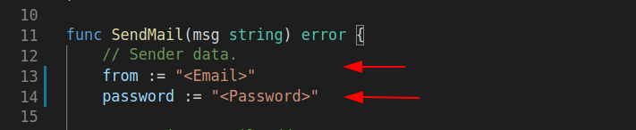

<p  align="center"></p>
<h2  align="center">Test project to external API communication</h2>

<p  align="center">Made with GoLang and Echo Framework </p>

<p  align="center">This system integrate with an external API and persists the data locally, executes the sync with a cron and do the CRUD operations</p>

  

<p  align="center">

<a  href="#install">Installation</a> •

<a  href="#docs">Documentation</a> •

<a  href="#tests">Tests</a> •

  

## ## Installation

<div  id="install">

<p>To install the application, the docker and docker-compose must be installed correctly  on your machine</p>

<p>The application will start on localhost (127.0.0.1) on 8000 port, and the mysql db will start on  3306 port, make sure these ports are free before starting the installation.</p>

<p>1. Enter on project folder: </p>

  

```

cd go_api

```

<p>2. Now we will run the containers using docker-compose:</p>

  

```

docker-compose up

```

  

</div>

  

## Documentation

<div  id="docs">
OBS. The CRON code is avaliable on main.go file!

<h3>OpenApi doc</h3>

<p>Documentation link from OAS v3:  <a  href="https://app.swaggerhub.com/apis-docs/brenddonanjos/go_api/1.0.0">CLICK HERE</a></p>
  

<h3>EER Diagram</h3>

<p>On <b>/docs</b> folder is available, an EER  diagram from database</p>

  

<h3>Postman access</h3>

<p>For custom requests and specific tests,  on <b>/docs</b> folder is available a postman collection and an environment. </p>

<p>For this part, the postman should be installed correctly on your machine</p>

<p>1. With the postman open import the environment <b>go_api.postman_collection</b>, just click on  "import" button on  upper right corner.</p>

<p>2. Now import the environment <b>go_api.postman_environment.json</b>  and select the environment on upper left corner</p>

  

<h3>Email configuration to errors notifications (Using by sync function)</h3>

<p>The application has an email send functionality on sync errors cases, to configure this are necessary to set a valid email and password on this file: <b>/src/actions/util.go -  lines: 13 and 14</b>  </p>

  

<p>Update values of these variables: <b>from</b> and <b>password</b>, make sure to set valid information. </p>



<p>Maybe are necessary to enable the less secure app's permission on your email, if you use Gmail it's possible to access this configuration this  <a  href="https://myaccount.google.com/lesssecureapps"  target="_blank">link</a></p>

<p>P.S. If we don't want to configure this, the application will continue correctly works</p>
  

## Tests

<div  id="tests">

<p>With the application running, we will enter on tests files directory and run the go command to initiate the process using the container bash</p>

  

```

docker exec -i backend bash -c "cd src/handlers && go test"

```

<p>For individual tests, we execute the following command:</p>

  

```

docker exec -i backend bash -c "cd src/handlers && go test -v -run <TestFunctionName>"

```

  
  

</div>

  

<h3>Used technologies</h3>

<p>The following technologies are being used on this project:</p>

  

- [GoLang](https://go.dev/)

- [Echo](https://echo.labstack.com/)

- [Docker](https://www.docker.com/)

- [Mysql](https://www.mysql.com/)